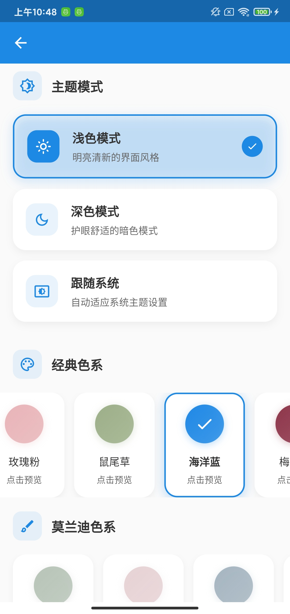

<p align="center">
    <a href="https://github.com/vtyug/yug-app" target="_blank">
        
    </a>
</p>

<p align="center">
    <a href="https://pkg.go.dev/github.com/vtyug/yug-app">
        
    </a>
    <a href="https://goreportcard.com/report/github.com/vtyug/yug-app">
        
    </a>
    <a href="https://github.com/vtyug/yug-app/blob/main/LICENSE">
        
    </a>
    <a href="https://github.com/vtyug/yug-app/issues">
        
    </a>
</p>

##### 🌐 Translate to: [English](./README.md)

基于 Flutter 和 gRPC 的移动应用开发框架。

## 📱 项目简介

YUG App 是一个使用 Flutter 和 gRPC 技术栈构建的移动应用开发框架，旨在提供高效的网络通信、优雅的用户界面及高质量的开发体验。

## 🏗️ 系统架构

系统架构分为以下几个主要部分：

1. **业务逻辑与服务层**

   - 导航和路由管理
   - 工具类库
   - 服务类

2. **配置与全局设置**

   - 配置文件管理
   - 全局初始化

3. **多平台启动器**
   支持多个平台：

   - Android
   - iOS
   - Linux
   - macOS
   - Windows
   - Web

4. **客户端层（UI 模块）**

   - 页面和视图
   - 可复用 UI 组件
   - 小部件
   - 样式和主题

5. **网络层**
   - gRPC 客户端
   - 外部后端通信

<p align="center">
    
</p>

## 📸 应用预览

<p align="center">
<table>
<tr>
<td align="center"><br/>英文登录界面</td>
<td align="center"><br/>中文登录界面</td>
</tr>
<tr>
<td align="center"><br/>多语言设置</td>
<td align="center"><br/>主题设置</td>
</tr>
<tr>
<td align="center" colspan="2"><br/>AI助手界面</td>
</tr>
</table>
</p>

## 🚀 快速开始

### 🛠️ 环境准备

1. **安装 protoc 编译器**

   - MacOS: 执行命令 `brew install protobuf`
   - Linux: 执行命令 `apt-get install protobuf-compiler`

2. **安装 Dart protoc 插件**

   执行命令 `dart pub global activate protoc_plugin`

3. **安装 Flutter 依赖**

   执行命令 `flutter pub get`

### 💻 编译 proto 文件

在项目根目录下执行以下命令：

```bash
protoc --dart_out=grpc:lib/common/net/grpcs/proto \
  --proto_path=protos \
  protos/*.proto
```

确保你在项目的根目录下执行此命令，而不是进入 `lib/common/net/grpcs/proto` 目录。

## 📂 目录结构说明

```
.
├── common                  # 公共模块，包含应用中常用的组件和工具
│   ├── components          # UI组件
│   ├── extension           # Dart扩展方法
│   ├── i18n                # 国际化支持
│   ├── index.dart          # 公共模块的索引文件
│   ├── models              # 数据模型
│   ├── net                 # 网络相关代码
│   ├── routers             # 路由配置
│   ├── services            # 服务类，处理业务逻辑
│   ├── style               # 样式文件
│   ├── utils              # 工具类和方法
│   ├── values             # 常量和枚举
│   └── widgets            # 自定义小部件
├── config                 # 配置文件
│   ├── grpc_channels.dart # gRPC通道配置
│   └── grpc_channels.dart.example # gRPC通道配置示例
├── docs                   # 文档
│   ├── dev               # 开发文档
│   └── images            # 图片资源
├── global.dart           # 全局配置和变量
├── main.dart            # 应用程序入口
└── pages               # 页面模块
    ├── index.dart      # 页面索引
    ├── my             # "我的"页面模块
    ├── search         # 搜索页面模块
    ├── styles         # 样式相关页面
    └── system         # 系统相关页面
```

## 📚 参考文档链接

- [Flutter 官方文档](https://flutter.dev/docs)
- [gRPC 官方文档](https://grpc.io/docs)

## ℹ️ 更多信息

有关开发指南和详细的开发规范，请参阅 [开发指南](docs/DEVELOPMENT_GUIDE.md)。
