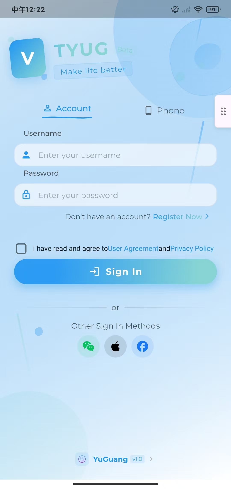

<p align="center">
    <a href="https://github.com/vtyug/yug-app" target="_blank">
        
    </a>
</p>

<p align="center">
    <a href="https://pkg.go.dev/github.com/vtyug/yug-app">
        
    </a>
    <a href="https://goreportcard.com/report/github.com/vtyug/yug-app">
        
    </a>
    <a href="https://github.com/vtyug/yug-app/blob/main/LICENSE">
        
    </a>
    <a href="https://github.com/vtyug/yug-app/issues">
        
    </a>
</p>

##### 🌐 Translate to: [简体中文](./README-CN.md)

A mobile application development framework based on Flutter and gRPC.

## 📱 Introduction

YUG App is a mobile application development framework built with Flutter and gRPC technology stack, designed to provide efficient network communication, elegant user interface, and high-quality development experience.

## 📸 App Preview

<p align="center">
<table>
<tr>
<td align="center"><br/>English Login</td>
<td align="center"><br/>Chinese Login</td>
</tr>
<tr>
<td align="center"><br/>Language Settings</td>
<td align="center"><br/>Theme Settings</td>
</tr>
<tr>
<td align="center" colspan="2"><br/>AI Assistant Interface</td>
</tr>
</table>
</p>

## 🚀 Quick Start

### 🛠️ Environment Setup

1. **Install protoc compiler**

   - MacOS: Run `brew install protobuf`
   - Linux: Run `apt-get install protobuf-compiler`

2. **Install Dart protoc plugin**

   Run `dart pub global activate protoc_plugin`

3. **Install Flutter dependencies**

   Run `flutter pub get`

### 💻 Compile proto files

Execute the following command in the project root directory:

```bash
protoc --dart_out=grpc:lib/common/net/grpcs/proto \
  --proto_path=protos \
  protos/*.proto
```

Make sure you execute this command in the project root directory, not in the `lib/common/net/grpcs/proto` directory.

## 📂 Directory Structure

```
.
├── common                  # Common modules containing frequently used components and utilities
│   ├── components          # UI components
│   ├── extension           # Dart extension methods
│   ├── i18n                # Internationalization support
│   ├── index.dart          # Index file for common modules
│   ├── models              # Data models
│   ├── net                 # Network-related code
│   ├── routers             # Routing configuration
│   ├── services            # Service classes handling business logic
│   ├── style               # Style files
│   ├── utils              # Utility classes and methods
│   ├── values             # Constants and enums
│   └── widgets            # Custom widgets
├── config                 # Configuration files
│   ├── grpc_channels.dart # gRPC channel configuration
│   └── grpc_channels.dart.example # Example gRPC channel configuration
├── docs                   # Documentation
│   ├── dev               # Development documentation
│   └── images            # Image resources
├── global.dart           # Global configurations and variables
├── main.dart            # Application entry point
└── pages               # Page modules
    ├── index.dart      # Page index
    ├── my             # "My" page module
    ├── search         # Search page module
    ├── styles         # Style-related pages
    └── system         # System-related pages
```

## 📚 Documentation Links

- [Flutter Official Documentation](https://flutter.dev/docs)
- [gRPC Official Documentation](https://grpc.io/docs)

## ℹ️ More Information

For development guidelines and detailed development specifications, please refer to the [Development Guide](docs/DEVELOPMENT_GUIDE.md).
